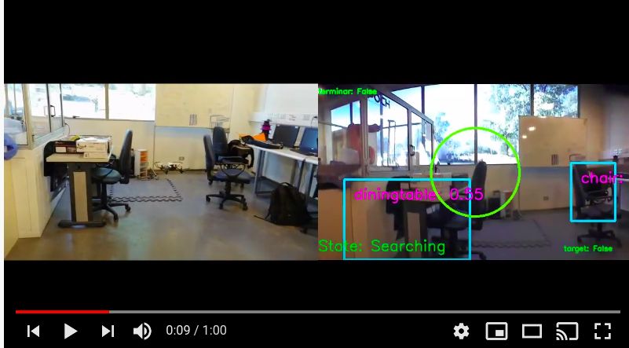

# Drone Autonomous Landing

## Getting Started

### Prerequisites

* [Pytorch 1.2](https://pytorch.org/)
* [pyparrot](https://github.com/amymcgovern/pyparrot)

### Results

### TODO

- [ ] Improve inference time of he model. Although the desicion 
- [ ] Improve navigation system. So far the navigation algorithm  to aproximate to target is pretty intuituve and is considering that the target will be always static. 
To make it more dynamic the system could be based on a prediction state filter like some kalman or particle filter
- [ ] Add pre-requisites ans installing instructions

